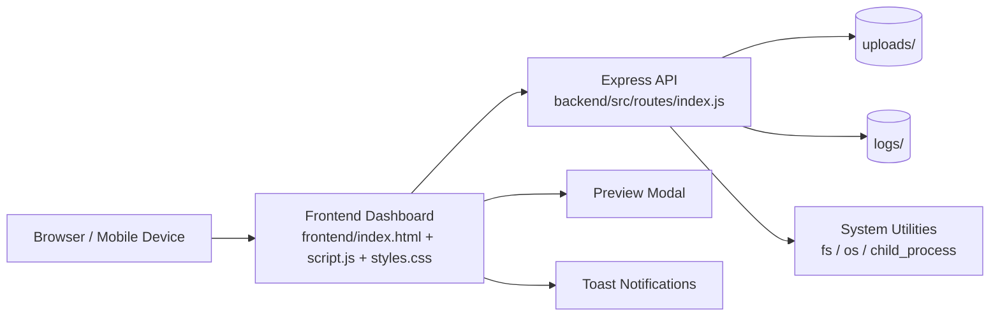

# Personal Cloud

Personal Cloud is a self-hosted cloud and backup platform built with Node.js, Express, and a modern vanilla frontend. It supports file upload, listing, preview, download, deletion, storage monitoring, system health monitoring, logging, and a responsive dashboard optimized for Android Termux deployment and remote access through Tailscale.

## Features

- Secure file upload with drag-and-drop and multi-file support.
- Browser-based file preview for images, PDFs, and videos.
- File listing, download, and deletion endpoints.
- Live storage monitoring and system health metrics.
- Activity logging for uploads, deletions, and login attempts.
- Responsive dashboard with a dark modern UI and toast notifications.
- Termux-friendly deployment on Android with `0.0.0.0` binding.
- Tailscale-compatible for private remote access.

## Screenshots

The project currently includes the full UI implementation, but no committed image assets. Recommended screenshots to add later:

- Dashboard overview with storage and system health cards.
- Upload panel showing drag-and-drop selection and progress.
- File preview modal for image, PDF, and video files.
- File library with download and delete actions.

Suggested location for future images: `docs/screenshots/`

## Architecture



### Backend flow

- `backend/src/server.js` starts the server and binds to `0.0.0.0`.
- `backend/src/app.js` configures middleware, CORS, JSON parsing, and error handling.
- `backend/src/routes/index.js` implements the API routes and local storage logic.
- `uploads/` stores user files.
- `logs/` stores JSONL activity logs.

### Frontend flow

- `frontend/index.html` defines the dashboard layout.
- `frontend/styles.css` provides the dark responsive UI and animations.
- `frontend/script.js` calls the backend APIs, renders file cards, and manages previews, uploads, progress, and notifications.

## Tech Stack

- Node.js
- Express.js
- Multer
- CORS
- dotenv
- HTML5, CSS3, Vanilla JavaScript
- Node core modules: `fs`, `os`, `path`, `child_process`

## Installation

### Prerequisites

- Node.js 18+ or a Termux Node.js package.
- A browser on the same device or network.

### Local setup

1. Clone the repository.
2. Install backend dependencies:

   ```bash
   cd backend
   npm install
   ```

3. Copy the example environment file:

   ```bash
   cp .env.example .env
   ```

4. Start the backend:

   ```bash
   npm start
   ```

5. Open the frontend dashboard:

   - Open `frontend/index.html` directly in a browser, or
   - Serve it through any static file server if you prefer.

## API Documentation

Base URL:

```text
http://127.0.0.1:3000
```

### `GET /`

Returns the health banner text.

Response:

```text
Personal Cloud Server Running
```

### `POST /upload`

Uploads a single file using form-data field name `file`.

Response:

```json
{
  "success": true,
  "message": "File uploaded successfully",
  "file": {
    "originalName": "example.png",
    "fileName": "123-example.png",
    "path": "/path/to/uploads/123-example.png",
    "size": 1024
  }
}
```

### `GET /files`

Returns all stored files with metadata.

Response fields:

- `name`
- `size`
- `uploadDate`

### `GET /preview/:filename`

Returns inline preview content for supported file types:

- Images: `.jpg`, `.jpeg`, `.png`, `.gif`, `.webp`, `.svg`
- Video: `.mp4`, `.webm`, `.ogg`
- PDFs: `.pdf`

### `GET /download/:filename`

Downloads a stored file as an attachment.

### `DELETE /delete/:filename`

Deletes a stored file and returns a success or error JSON response.

### `GET /storage`

Returns live storage information for the uploads volume.

Response fields:

- `totalStorage`
- `usedStorage`
- `freeStorage`

### `GET /system-info`

Returns live system metrics.

Response fields:

- `cpuUsage`
- `ramUsage`
- `uptime`
- `hostname`
- `platform`

### `GET /logs`

Returns recent activity entries from `logs/activity.log`.

### `POST /login`

Logs a login attempt for monitoring purposes.

Request body:

```json
{
  "username": "demo"
}
```

## Termux Deployment

For a phone-specific guide, see [README-TERMUX.md](README-TERMUX.md).

1. Install Node.js in Termux.
2. Clone or copy the project onto the Android device.
3. Enter the backend folder:

   ```bash
   cd backend
   ```

4. Create a local environment file:

   ```bash
   cp .env.example .env
   ```

5. Keep these values for Termux access:

   ```env
   PORT=3000
   HOST=0.0.0.0
   NODE_ENV=production
   CORS_ORIGIN=*
   ```

6. Install dependencies:

   ```bash
   npm install
   ```

7. Start the backend:

   ```bash
   npm start
   ```

8. Open the dashboard in the Android browser:

   ```text
   http://127.0.0.1:3000
   ```

9. For access from another device on the same network, use the phone's LAN IP and the same port.

## Tailscale Setup

Tailscale lets you access the server privately over an encrypted network without exposing it publicly.

### Android device

1. Install and sign in to Tailscale on the Android device.
2. Keep the backend bound to `0.0.0.0`.
3. Start the server in Termux.
4. Note the Tailscale IP or MagicDNS name shown by Tailscale.

### Remote device

1. Install Tailscale on the remote device.
2. Sign in to the same Tailscale network.
3. Open the Personal Cloud server using the Android device's Tailscale IP or MagicDNS hostname.

### Recommended environment settings

```env
HOST=0.0.0.0
CORS_ORIGIN=*
NODE_ENV=production
```

If you serve the frontend from a different origin, set `CORS_ORIGIN` to that exact origin instead of `*`.

## Production Notes

- `backend/src/server.js` binds to `0.0.0.0` for Termux, LAN, and Tailscale access.
- `backend/src/app.js` includes centralized error handling and request parsing limits.
- `backend/src/config.js` reads all deployment values from environment variables.
- `uploads/` and `logs/` are created automatically if missing.

## Future Improvements

- Authentication and session management.
- File folders and tagging.
- Resumable uploads for large files.
- Per-file share links and access control.
- Search, sort, and filters in the dashboard.
- Storage quota controls and alerts.
- Log viewer and export/download options.
- Thumbnail generation for image and video previews.
- Native mobile app wrapper or PWA support.

## Project Structure

```text
PersonalCloud/
├── backend/
│   ├── .env.example
│   ├── package.json
│   └── src/
│       ├── app.js
│       ├── config.js
│       ├── routes/
│       │   └── index.js
│       └── server.js
├── frontend/
│   ├── index.html
│   ├── script.js
│   └── styles.css
├── logs/
└── uploads/
```